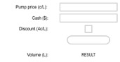

# Pumping-petrol
Code example for Y10 programming class demonstrating Entry, Button, Checkbox and Label widgets.

## Design / SRS
### Overview
Design a simple UI app that takes a sum of available cash of a desired spend in dollars, the pump price in cents per litre, whether or not a discount of 4 c/L is to be applied (via a supermarket voucher) and returns the volume of petrol that can be pumped for that amount of cash.
### Functional Requirements
App must take available cash in dollars.
App must take pump price in cents per litre.
App must be able to apply a fixed discount of 4 c/L.
App must return volume to pump in Litres.
### Non Functional Requirements
App should be written in a single file.
### Scope
Formatting the output to $x.yy is not in scope.

### UI

